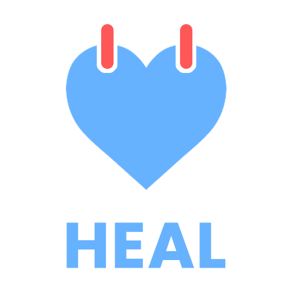
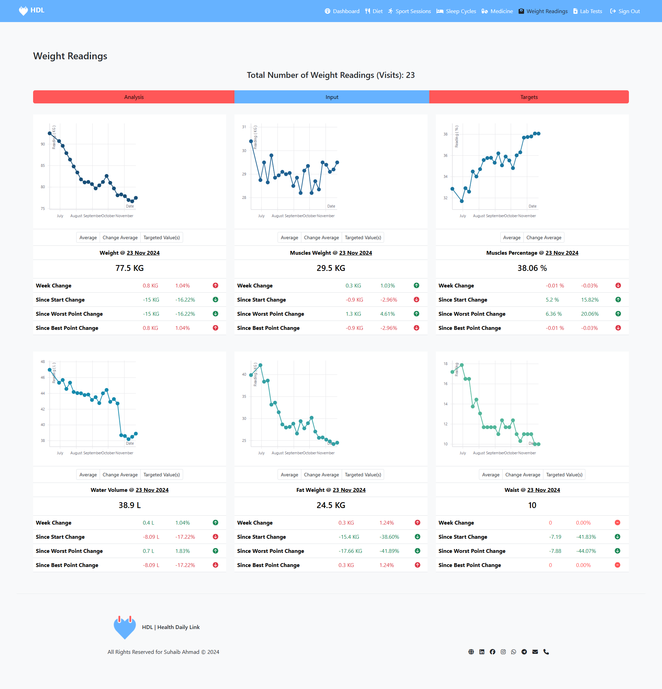
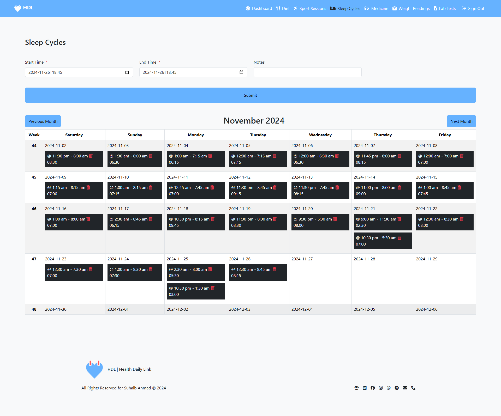

# Health Daily Link (HDL)



Welcome to [**Health Daily Link (HDL)**](https://health-daily-link.vercel.app/), your all-in-one platform for tracking and improving your health. Whether you're managing your daily wellness activities or looking for insights into your long-term progress, HDL is your trusted companion. This open-source project invites contributions from the community to expand its features and impact.

## What is Health Daily Link?

**Health Daily Link (HDL)** is a comprehensive web app designed to help individuals track their health-related activities and stay consistent with their wellness goals. From daily routines like diet and hydration to broader metrics like sleep and weight tracking, HDL makes it simple to log, monitor, and analyze your progress.

**The best part?** HDL is completely open-source, making it customizable and community-driven.

## Screenshots

<p align="center">
  
  
</p>

## Features

- **Meal Scheduling**  
  Stay on track with your nutrition plan by logging and following scheduled meals.

- **Hydration Logging**  
  Record your water intake to maintain optimal hydration levels.

- **Exercise Tracking**  
  Log your physical activities, including sports, workouts, and walks.

- **Medication Follow-Up**  
  Never miss a dose by keeping track of your medications and supplements.

- **Sleep Cycle Monitoring**  
  Monitor and improve your sleep patterns for better rest and recovery.

- **Weight Tracking**  
  Log and monitor your weight, with support for inBody scale or any detailed-reading providers.

- **Secured Access**  
  User-only access for own data view & manipulation with Firebase authentication.

- **Open-Source**  
  Totally transparency and ability for any web developer to contribute and enhance.

- **Modern Tech Stack**  
  Built with React.Js and Firebase for an optimized, scalable, and responsive web experience.

## Coming Soon Features

- **Mobile App**  
  A dedicated app for tracking health on the go.

- **Set Reminders**  
  Notifications for meals, workouts, medications, and more.

- **Nutritionist Access**  
  Allow experts to review and provide feedback on dietary progress.

- **AI-Powered Insights**  
  Automatic data entry and meaningful health recommendations.

- **Advanced Analytics**  
  Generate summaries and visualizations for deeper insights into your habits.

- **Calorie Tracking**  
  Automatic calorie calculations for scheduled and consumed meals.

- **Localization**  
  Support for multiple languages, including Arabic.

- **Goal Setting**  
  Personalized health targets and progress tracking.

- **Multi-User Functionality**  
  Perfect for families or teams to collaborate on health goals.

- **Community Integration**  
  Build a platform for shared wellness experiences and tips.
  
## How to Start Using

Health Daily Link is already deployed, so you can simply sign up and start using it today! [Visit Health Daily Link](https://health-daily-link.vercel.app/)  

## Developer Notes

### Technology Stack

- Frontend: React.Js
- Backend: Firebase Realtime Database, Firebase Authentication
- UI Framework: Bootstrap 5
- Charts and Visualization: React-Vis
- Development Tools: Yarn, ESLint, Prettier

### Contribution Guidelines

Contributions are what make the open-source community such an amazing place to learn, inspire, and create. Any contributions you make are **greatly appreciated**.

To contribute:

1. Fork the project.
2. Create your feature branch: `git checkout -b feature/YourFeatureName`.
3. Commit your changes: `git commit -m 'Add some YourFeatureName'`.
4. Push to the branch: `git push origin feature/YourFeatureName`.
5. Open a pull request.

Please ensure your code adheres to the project's guidelines and is well-documented.

### How to Start Development

1. **Fork the repository** to your GitHub account.
2. **Clone the forked repository** to your local machine.
3. Navigate to the project root directory:

  ```bash
    cd health-daily-link
  ```

4. Install dependencies:

  ```bash
    npm i
  ```

5. Start the development server:  

  ```bash
    npm run dev
  ```

6. Open your browser and navigate to the development server URL (usually `http://localhost:3000`) to view the application.
7. Make changes to the code as needed, and watch for live updates.

### How to Report an Issue

We welcome contributions and feedback! To report a bug, suggest a feature, or request support:

1. Go to the [Issues](https://github.com/health-daily-link/issues) tab of this repository.
2. Click on **New Issue**.
3. Select the appropriate issue template:

   - **Bug Report**: If you found a bug or error in the app.
   - **Feature Request**: If you have an idea for a new feature or improvement.

4. Fill out the form with as much detail as possible.
5. Submit the issue, and we’ll review it as soon as possible.

## Technical Support

If you encounter any issues, have questions, or want to suggest improvements, feel free to:

1. Open an issue on the [GitHub repository](https://github.com/makkahwi/health-daily-link/issues).
2. Reach out to the project maintainer via the contact information provided in the repository.
3. Join the discussions on the repository to collaborate with other contributors.

We appreciate your feedback and contributions to make the "Health Daily Link" better for everyone!

## ⭐ Support the Project ⭐

Your support is vital to making **Health Daily Link** even better! Here’s how you can contribute and help spread the word:

### 🌟 As a Developer  

Dive into the codebase, identify bugs, or build new features. Check out our [Developer Notes](#developer-notes) for more details on how to get started.

### ⭐ As a GitHub User  

Starring our repository is a quick and easy way to show your support and help others discover this project.  

👉 **[Click here to star the repo](https://github.com/makkahwi/health-daily-link/stargazers)** 👈  

[](https://github.com/makkahwi/health-daily-link/stargazers)

### ❤️ GitHub Sponsors  

Your financial support can accelerate the development of **Health Daily Link** by covering costs like hosting, integrations, and feature enhancements.

👉 **[Become a Sponsor](https://github.com/sponsors/makkahwi)** 👈

### 📣 Spread the Word  

Help us reach more users and contributors by sharing the **Health Daily Link** app with your network!  

Click below to share on your favorite platform:

- **[Share on Twitter (X)](https://twitter.com/intent/tweet?text=Check+out+this+open-source+project+to+track+your+health+journey!+Health+Daily+Link+is+a+React.js+and+Firebase-based+app+that+lets+you+monitor+diet%2C+hydration%2C+exercise%2C+sleep%2C+and+more.+%23OpenSource+%23HealthTracking&url=https://github.com/makkahwi/health-daily-link/)**  
- **[Share on LinkedIn](https://www.linkedin.com/shareArticle?mini=true&url=https://github.com/makkahwi/health-daily-link/&title=Check+out+Health+Daily+Link!&summary=An+open-source+project+to+track+and+improve+your+health+journey.+Monitor+diet%2C+hydration%2C+exercise%2C+sleep%2C+and+more+with+this+React.js+and+Firebase-based+app.&source=)**  
- **[Share on Facebook](https://www.facebook.com/sharer/sharer.php?u=https://github.com/makkahwi/health-daily-link/)**  
- **[Share on Reddit](https://www.reddit.com/submit?url=https://github.com/makkahwi/health-daily-link/&title=Check+out+Health+Daily+Link%21)**  

## License

This project is licensed under the MIT License. See the `LICENSE` file for more details.

## Acknowledgements

- [React.js](https://react.dev/) - The frontend framework that powers this app.
- [Firebase](https://firebase.google.com/) - The backend platform used for data storage and authentication.
- [Bootstrap](https://getbootstrap.com/) - The CSS framework for responsive design.
- All contributors who have helped build and improve this project.

## Meet the Developer

This is **Suhaib Ahmad**, a software developer passionate about leveraging technology to improve health and wellness.

- **Website:** [Suhaib.dev](https://www.suhaib.dev/)  
- **GitHub:** [Makkahwi](https://github.com/makkahwi/)  
- **Email**: [SuhaibAhmadAi@hotmail.com](mailto:SuhaibAhmadAi@hotmail.com)

## Contact

If you have any questions about the project, feel free to reach out the developer.

Thank you for your interest in "Health Daily Link"! Together, we can make it the go-to solution for healthy-lifestyle enthusiasts worldwide.
